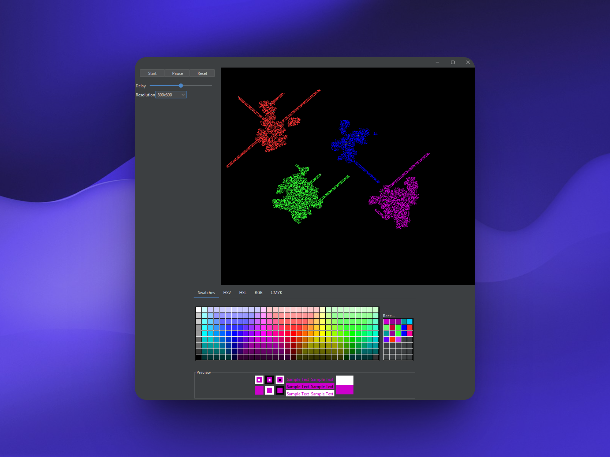

# Langton's Ant - Swing Visualization



A Java Swing implementation of **Langton's Ant** — a simple Turing machine with emergent complex behavior. This version includes support for multiple ants, customizable colors, adjustable simulation speed, and grid resolution. The GUI is built with Swing and provides an interactive way to explore.

---

## Features

- **Multiple Ants**  
- **Custom Ant Colors** (HSV, HSL, RGB, CMYK & Swatches)
- **Adjustable Grid Resolution**
- **Speed Control (Delay Slider)**
- **Pause / Play / Reset Controls**
- **Adjustable resolution**

---

## Getting Started

### Prerequisites

- Java 17 or higher
- Gradle (optional, wrapper included)

### Running the Project

1. **Clone the repository**

```bash
git clone https://github.com/jeetbhow/langton.git
cd langton
```

2. **Build and Run**
```
gradle run
```

Or use the Gradle Wrapper:
```
./gradlew run
```